# Downloading data from STAC APIs using rsi

This article walks through downloading data from STAC APIs using rsi, as
well as using CQL2 to run more complicated queries. These tutorials are
directly adapted from the [downloading
data](https://stacspec.org/en/tutorials/1-download-data-using-r/) and
[using
CQL2](https://stacspec.org/en/tutorials/2-using-rstac-and-cql2-to-query-stac-api/)
tutorials on the STAC website, originally written by Mike Mahoney and
licensed [CC-BY 4.0](https://creativecommons.org/licenses/by/4.0/). This
tutorial assumes you’re already pretty familiar with working with
spatial data in R.

To get started, we’ll go ahead and load rsi, which we’ll be using to
download our data:

``` r

library(rsi)
```

We’ll also be using sf, to specify our spatial area of interest; terra,
to visualize our downloaded data; and rstac, to show how STAC objects
are generally organized. We aren’t going to attach any of these, in
order to make it clear what functions are coming from rsi itself. They
should all be installed as part of installing rsi, so you shouldn’t need
to install anything new for this tutorial.

## An overview of STAC itself

You can safely skip this section if you’re familiar with STAC and rstac.

Before we start downloading data, let’s talk a little bit about STAC.
STAC is, to [quote the project’s main
repository](https://github.com/radiantearth/stac-spec), “a family of
specifications aim to standardize the way geospatial asset metadata is
structured and queried”. STAC provides a useful set of standardized
metadata fields, and standardized ways of organizing and distributing
data products, which make it a lot easier for data producers to document
and share their data, and for data consumers to discover, query, access,
and harmonize available products.

There’s some amount of unavoidable complexity that you need to push
through before it actually *feels* easier, though. STAC introduces a
number of new object types, each of which have their own standardized
metadata fields and behaviors. The actual geospatial data you want to
access is called an *asset*. Multiple assets which share metadata – in
particular, which share a spatiotemporal extent – may be grouped into a
STAC *item*, and multiple items which share metadata may be grouped into
a STAC *collection*. STAC APIs then expose these objects to the
internet, and let users explore them via HTTP requests.

To give a more concrete example: the red band of a single Landsat image
would be a STAC asset. It would be combined with all the other bands
acquired from that same image into a STAC item, which would then be
combined with all other available Landsat images into a STAC collection.
If this collection was then included in a STAC API, you could send a
request to list all the available collections, to list all the items
included in the Landsat collection, or to list all the assets available
in a given item. You could also narrow down the results of these
requests using queries – listing only the items inside a given
spatiotemporal bounding box, or under a certain cloud cover threshold,
for instance.

This explanation is a very simplified overview of the STAC family of
standards – for instance, items may also be grouped into *catalogs*, and
collections and catalogs may themselves be grouped into other
collections and catalogs. For all practical purposes however, if your
main interest is downloading data from STAC APIs, the simplified
explanation is pretty decent.

For instance, we can see this organization in the wild by using rstac to
explore a public STAC API. Microsoft hosts a STAC API as part of their
[Planetary Computer](https://planetarycomputer.microsoft.com/); we’ll
use their API for the rest of this tutorial.

To start downloading data, we’ll first need to let rstac know what STAC
API we want to query and download from. To do so, we’ll pass the URL of
the Planetary Computer STAC API to the
[`rstac::stac()`](https://brazil-data-cube.github.io/rstac/reference/stac.html)
function:

``` r

stac_source <- rstac::stac(
  "https://planetarycomputer.microsoft.com/api/stac/v1"
)
stac_source
#> ###rstac_query
#> - url: https://planetarycomputer.microsoft.com/api/stac/v1/
#> - params:
#> - field(s): version, base_url, endpoint, params, verb, encode
```

As you can see, the output of `stac()` is an `RSTACQuery` object, which
contains information about an HTTP query. Specifically, it’s worth
highlighting that this object is a representation of a *future* HTTP
query, not the results of one that we’ve already run! In order to
actually execute these requests, we need to use
[`rstac::get_request()`](https://brazil-data-cube.github.io/rstac/reference/request.html)
(or
[`rstac::post_request()`](https://brazil-data-cube.github.io/rstac/reference/request.html),
depending on what HTTP verb your STAC API is expecting). If we use
`get_request()` to query the Planetary Computer STAC API, we get a brief
description of what this API provides:

``` r

rstac::get_request(stac_source)
#> ###Catalog
#> - id: microsoft-pc
#> - description: 
#> Searchable spatiotemporal metadata describing Earth science datasets hosted by the Microsoft Planetary Computer
#> - field(s): 
#> type, id, title, description, stac_version, conformsTo, links, stac_extensions
```

Because the `RSTACQuery` object is a representation of a future query,
we can use other functions in rstac to change our query parameters and
fields before we actually make a request. For instance, we can use
[`rstac::collections()`](https://brazil-data-cube.github.io/rstac/reference/collections.html)
to update our request to query the `/collections` endpoint of the
Planetary Computer API, which lists all the collections available from
this API:

``` r

stac_source |>
  rstac::collections() |>
  rstac::get_request()
#> ###Collections
#> - collections (136 item(s)):
#>   - daymet-annual-pr
#>   - daymet-daily-hi
#>   - 3dep-seamless
#>   - 3dep-lidar-dsm
#>   - fia
#>   - gridmet
#>   - daymet-annual-na
#>   - daymet-monthly-na
#>   - daymet-annual-hi
#>   - daymet-monthly-hi
#>   - ... with 126 more collection(s).
#> - field(s): collections, links, numberMatched, numberReturned
```

These collections are a subset of the data sets available in the
[Planetary Computer data
catalog](https://planetarycomputer.microsoft.com/catalog); the Planetary
Computer is organized so that each collection corresponds to a distinct
data set in the catalog.

For our purposes today, we’re going to be querying two different
collections: first, the [USGS Land Change Monitoring, Assessment, and
Projection
(LCMAP)](https://planetarycomputer.microsoft.com/dataset/usgs-lcmap-conus-v13)
collection, which provides (among other things) annual land cover
classifications for the continental United States, and secondly the
[Landsat Collection 2
Level-2](https://planetarycomputer.microsoft.com/dataset/landsat-c2-l2)
collection, which provides global satellite imagery.

We can query what items are available for either collection using the
[`rstac::stac_search()`](https://brazil-data-cube.github.io/rstac/reference/stac_search.html)
function. We can limit our search to 2021 using the `datetime` argument,
ask for up to 999 items (the most Planetary Computer will return in a
single request) using the `limit` argument, and only search within the
LCMAP collection by using the collection’s ID of `usgs-lcmap-conus-v13`:

``` r

rstac::stac_search(
  q = stac_source,
  collections = "usgs-lcmap-conus-v13",
  datetime = "2021-01-01/2021-12-31",
  limit = 999
) |>
  rstac::get_request()
#> ###Items
#> - features (422 item(s)):
#>   - LCMAP_CU_032003_2021_V13_CCDC
#>   - LCMAP_CU_031006_2021_V13_CCDC
#>   - LCMAP_CU_031004_2021_V13_CCDC
#>   - LCMAP_CU_031003_2021_V13_CCDC
#>   - LCMAP_CU_031002_2021_V13_CCDC
#>   - LCMAP_CU_030007_2021_V13_CCDC
#>   - LCMAP_CU_030006_2021_V13_CCDC
#>   - LCMAP_CU_030005_2021_V13_CCDC
#>   - LCMAP_CU_030004_2021_V13_CCDC
#>   - LCMAP_CU_030003_2021_V13_CCDC
#>   - ... with 412 more feature(s).
#> - assets: 
#> browse, dates, lcachg, lcachg_metadata, lcpconf, lcpconf_metadata, lcpri, lcpri_metadata, lcsconf, lcsconf_metadata, lcsec, lcsec_metadata, rendered_preview, sclast, sclast_metadata, scmag, scmag_metadata, scmqa, scmqa_metadata, scstab, scstab_metadata, sctime, sctime_metadata, tilejson
#> - item's fields: 
#> assets, bbox, collection, geometry, id, links, properties, stac_extensions, stac_version, type
```

We can see that there are 422 items inside this catalog for 2021.
Collectively, these items contain all LCMAP data for the continental
United States for 2021, with each item containing a number of assets.
We’ll be specifically downloading the `lcpri` and `lcsec` assets in a
minute – the primary and secondary land cover classification layers of
these data products.

To query the Landsat archives, we’d just swap out our collections
argument. I’m also going to drop the `limit` argument here – there are
way, way more than 1,000 Landsat images from 2021, and we don’t need a
full list of them right now:

``` r

rstac::stac_search(
  q = stac_source,
  collections = "landsat-c2-l2",
  datetime = "2021-01-01/2021-12-31"
) |>
  rstac::get_request()
#> ###Items
#> - features (250 item(s)):
#>   - LC09_L2SR_088122_20211230_02_T2
#>   - LC09_L2SR_088121_20211230_02_T2
#>   - LC09_L2SR_088120_20211230_02_T2
#>   - LC09_L2SR_088119_20211230_02_T2
#>   - LC09_L2SR_088118_20211230_02_T2
#>   - LC09_L2SR_088117_20211230_02_T2
#>   - LC09_L2SR_088116_20211230_02_T2
#>   - LC09_L2SR_088115_20211230_02_T2
#>   - LC09_L2SR_088114_20211230_02_T2
#>   - LC09_L2SR_088113_20211230_02_T2
#>   - ... with 240 more feature(s).
#> - assets: 
#> ang, atran, blue, cdist, coastal, drad, emis, emsd, green, lwir11, mtl.json, mtl.txt, mtl.xml, nir08, qa, qa_aerosol, qa_pixel, qa_radsat, red, rendered_preview, swir16, swir22, tilejson, trad, urad
#> - item's fields: 
#> assets, bbox, collection, geometry, id, links, properties, stac_extensions, stac_version, type
```

If we wanted a full list, we could pipe the outputs of our query object
to
[`rstac::items_fetch()`](https://brazil-data-cube.github.io/rstac/reference/items_functions.html)
to iterate through all the pages of our request. We aren’t going to do
that right now – it takes a long time and we don’t need to – but put a
pin in this idea, for later.

## Downloading data from STAC APIs using rsi

It took us a thousand words, but we’ve finally reached the title of the
vignette: how can we actually download data from this API?

We’ll start off downloading data for a relatively small region; namely,
North Carolina’s Ashe County. We’ll use data included in the sf package
to get the county’s geometry:

``` r

nc <- sf::read_sf(system.file("shape/nc.shp", package = "sf"))
ashe <- nc[1, ]

sf::st_geometry(ashe) |> plot()
```


And… that’s all the prep we need. We can go ahead and use this object
with the
[`get_stac_data()`](https://docs.ropensci.org/rsi/reference/get_stac_data.md)
function from rsi, which takes a number of arguments to determine
*which* STAC data we’re trying to get and what exactly we want to do
with it. Let’s use it to download the primary land cover classification
asset from LCMAP for this area – the `lcpri` asset:

``` r

ashe_lcpri <- get_stac_data(
  # Spatial AOI:
  aoi = ashe,
  # Temporal AOI:
  start_date = "2021-01-01",
  end_date = "2021-12-31",
  # Which asset do we want, from which collection, from which API:
  asset_names = "lcpri",
  stac_source = "https://planetarycomputer.microsoft.com/api/stac/v1",
  collection = "usgs-lcmap-conus-v13",
  # Where to save the file:
  output_filename = tempfile(fileext = ".tif")
)

ashe_lcpri
#> [1] "/tmp/Rtmp1bCTen/file958562e01dc.tif"
```

And a few seconds later, we’ve got our data! The output from
[`get_stac_data()`](https://docs.ropensci.org/rsi/reference/get_stac_data.md)
is a path to this data, saved as a raster somewhere on our computer;
that means we can pass this object to
[`terra::rast()`](https://rspatial.github.io/terra/reference/rast.html)
and
[`terra::plot()`](https://rspatial.github.io/terra/reference/plot.html)
to load this data into R and visualize it:

``` r

terra::rast(ashe_lcpri) |>
  terra::plot()
```

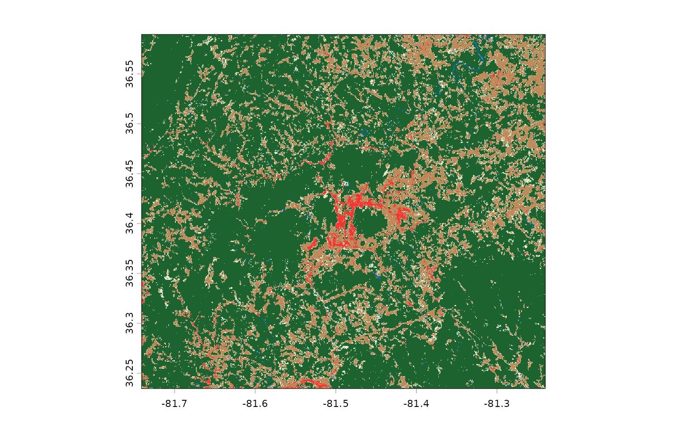

If we draw our Ashe county polygon on top of this raster, we can see
that
[`get_stac_data()`](https://docs.ropensci.org/rsi/reference/get_stac_data.md)
has only downloaded the portion of this asset that falls within the
bounding box we provided:

``` r

terra::rast(ashe_lcpri) |>
  terra::plot()
terra::plot(terra::vect(ashe), add = TRUE, col = "red")
```

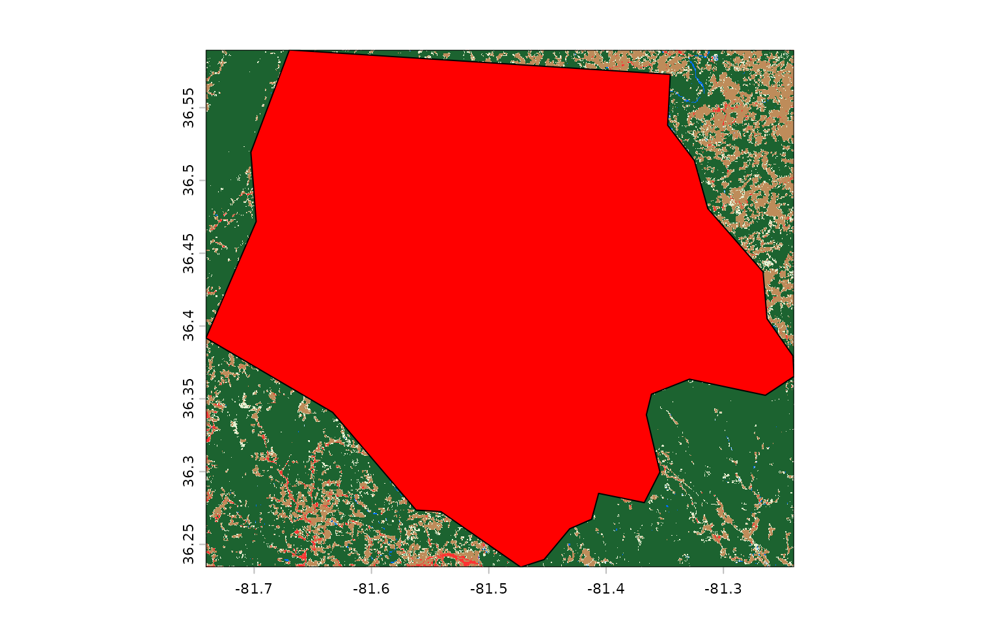

What if we wanted to download more than one raster asset? We could
choose to pass multiple asset names to `asset_names`. For instance, if
we wanted to also download the secondary land cover classification for
this area (called `lcsec`), we could write:

``` r

get_stac_data(
  aoi = ashe,
  start_date = "2021-01-01",
  end_date = "2021-12-31",
  asset_names = c("lcpri", "lcsec"), # this is the only change!
  stac_source = "https://planetarycomputer.microsoft.com/api/stac/v1",
  collection = "usgs-lcmap-conus-v13",
  output_filename = tempfile(fileext = ".tif")
) |>
  terra::rast() |>
  terra::plot()
```

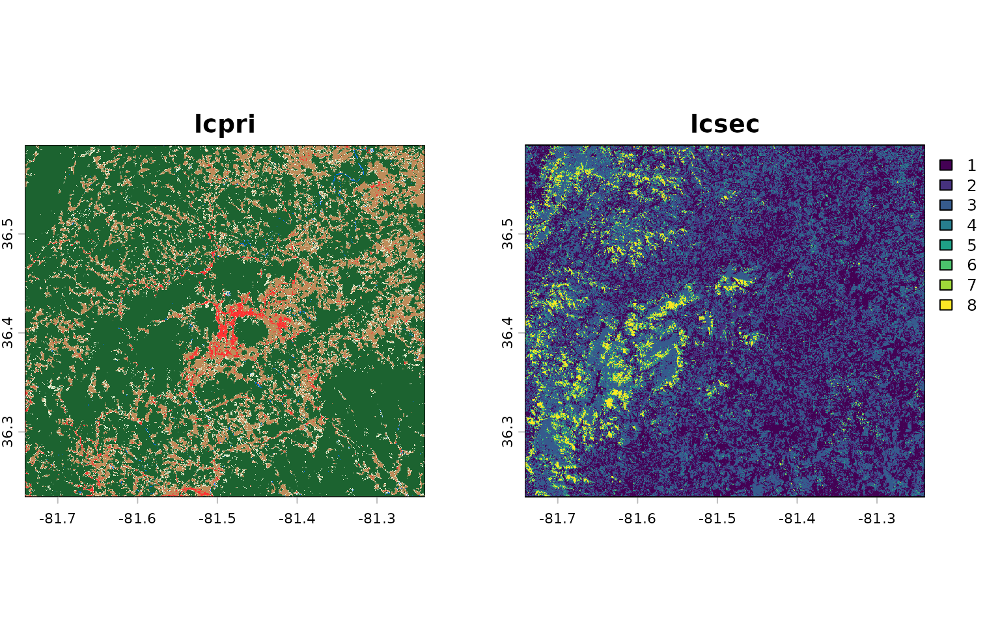

Neat!

Now, as it happens, Ashe county is entirely contained inside a single
LCMAP tile – so it’s returned by our API as a single STAC item. What if
we wanted to download the same asset from a larger area, that included
more than one item? For instance, what if we wanted to download these
assets for all of North Carolina?

To do so, we just need to change our `aoi` object to our `nc` object,
specifying the entire state of North Carolina. Internally,
[`get_stac_data()`](https://docs.ropensci.org/rsi/reference/get_stac_data.md)
will handle downloading the relevant pieces of each object and merging
them together:

``` r

get_stac_data(
  aoi = nc, # this is the only change!
  start_date = "2021-01-01",
  end_date = "2021-12-31",
  asset_names = c("lcpri", "lcsec"),
  stac_source = "https://planetarycomputer.microsoft.com/api/stac/v1",
  collection = "usgs-lcmap-conus-v13",
  output_filename = tempfile(fileext = ".tif")
) |>
  terra::rast() |>
  terra::plot()
```

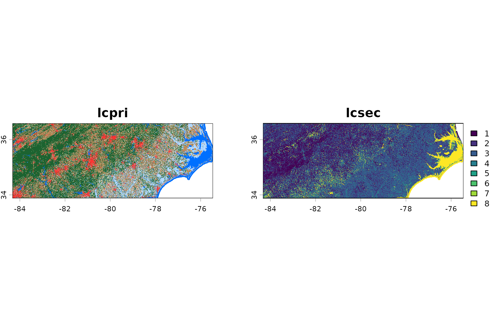

If we wanted, we could parallelize these downloads using
[`future::plan()`](https://future.futureverse.org/reference/plan.html),
and set up a progress bar using
[`progressr::handlers()`](https://progressr.futureverse.org/reference/handlers.html).
We won’t use these functions in this vignette, but they can be extremely
useful for speeding up and monitoring larger downloads.

By default, the merging done by
[`get_stac_data()`](https://docs.ropensci.org/rsi/reference/get_stac_data.md)
does not interpolate between overlapping pixels, and instead simply uses
the value from whichever pixel it processed last. That’s fine here,
where our tiles shouldn’t overlap (and pixel values should be identical
if they do), but probably isn’t ideal if you want to combine images from
multiple time periods into a single composite.

For instance, if we want to download a composite of all the available
Landsat images over Ashe county from a given month, we’d probably want
to calculate the median value of each pixel, instead of simply taking
the last value from each. We could do that by adding
`composite_function = "median"` to our
[`get_stac_data()`](https://docs.ropensci.org/rsi/reference/get_stac_data.md)
call.

But that said, we’d probably want to do a number of other things, too.
For instance, we probably don’t want to include images of clouds, or
dark shadows, in that composite; we also probably only want images from
some subset of Landsat missions, and to rescale our bands to retrieve
original measurement values, and so on and so forth. This all sounds
really fiddly.

For that reason, rsi provides a function,
[`get_landsat_imagery()`](https://docs.ropensci.org/rsi/reference/get_stac_data.md),
which wraps
[`get_stac_data()`](https://docs.ropensci.org/rsi/reference/get_stac_data.md)
and sets a number of arguments to helpful default values. We use the
following block of code to see exactly what defaults have been changed:

``` r

# Get the arguments, and default values, from
# get_stac_data and get_landsat_imagery
gsd_formals <- formals(get_stac_data)
gli_formals <- formals(get_landsat_imagery)

# Drop empty arguments
gsd_formals <- gsd_formals[vapply(gsd_formals, class, character(1)) != "name"]
gli_formals <- gli_formals[vapply(gli_formals, class, character(1)) != "name"]

# Highlight changed default values
setdiff(gli_formals, gsd_formals)
#> [[1]]
#> c("landsat-9", "landsat-8")
#> 
#> [[2]]
#> [1] 30
#> 
#> [[3]]
#> rsi::landsat_band_mapping$planetary_computer_v1
#> 
#> [[4]]
#> attr(asset_names, "stac_source")
#> 
#> [[5]]
#> attr(asset_names, "collection_name")
#> 
#> [[6]]
#> attr(asset_names, "query_function")
#> 
#> [[7]]
#> attr(asset_names, "download_function")
#> 
#> [[8]]
#> attr(asset_names, "sign_function")
#> 
#> [[9]]
#> attr(asset_names, "mask_band")
#> 
#> [[10]]
#> attr(asset_names, "mask_function")
#> 
#> [[11]]
#> [1] "median"
```

Some of these defaults make sense: we can see that our function is going
to be downloading data from Landsat-9 and Landsat-8, at a 30 meter
resolution, and compositing images by calculating the median of each
pixel’s measurements. That’s all well and good.

But some of these defaults are a bit confusing. We’re apparently setting
our `asset_names` argument to some random object we haven’t seen before,
and then setting our STAC API’s URL, the collection we’re downloading
from, the method we’re using to query the API, and a few things
(including some arguments that look like they control masking the
downloaded image) based on attributes of that object?

Basically, yes. When you load rsi, you also load a handful of “band
mapping” objects, which can be used to control how rsi functions
download and process data. These objects are organized by the collection
of data they correspond to, and contain sub-objects for all of the
different supported STAC APIs that you can use to download this data
from. For instance, the `landsat_band_mapping` contains information that
rsi can use to download imagery from the Planetary Computer:

``` r

landsat_band_mapping
#> $planetary_computer_v1
#> An rsi band mapping object with attributes:
#> names mask_band mask_function stac_source collection_name query_function download_function sign_function class
#> 
#> coastal    blue   green     red   nir08  swir16  swir22    lwir  lwir11 
#>     "A"     "B"     "G"     "R"     "N"    "S1"    "S2"     "T"    "T1"
```

While the `sentinel2_band_mapping` additionally contains information
about how to download data from both versions of the STAC API provided
by Amazon Web Services’ Open Data portal:

``` r

sentinel2_band_mapping
#> $aws_v0
#> An rsi band mapping object with attributes:
#> names mask_band mask_function stac_source collection_name query_function class
#> 
#>   B01   B02   B03   B04   B05   B06   B07   B08   B8A   B09   B11   B12 
#>   "A"   "B"   "G"   "R" "RE1" "RE2" "RE3"   "N"  "N2"  "WV"  "S1"  "S2" 
#> 
#> $aws_v1
#> An rsi band mapping object with attributes:
#> names mask_band mask_function stac_source collection_name query_function download_function class
#> 
#>     blue  coastal    green      nir    nir08    nir09      red rededge1 
#>      "B"      "A"      "G"      "N"     "N2"     "WV"      "R"    "RE1" 
#> rededge2 rededge3   swir16   swir22 
#>    "RE2"    "RE3"     "S1"     "S2" 
#> 
#> $planetary_computer_v1
#> An rsi band mapping object with attributes:
#> names mask_band mask_function stac_source collection_name query_function class scl_name download_function sign_function
#> 
#>   B01   B02   B03   B04   B05   B06   B07   B08   B8A   B09   B11   B12 
#>   "A"   "B"   "G"   "R" "RE1" "RE2" "RE3"   "N"  "N2"  "WV"  "S1"  "S2"
```

These objects are called “band mapping” objects because the contents of
the object explain how to map asset names, as understood by a given STAC
API, to [the standardized names used by the Awesome Spectral Indices
project](https://github.com/awesome-spectral-indices/awesome-spectral-indices).
But they contain a good bit of additional information on how to use each
individual STAC API, attached to the list as attributes; these include
the URL for the relevant STAC API, information on how to query the API
and “sign” item URLs for authentication purposes, and (when possible)
information on how to mask low-quality pixels out of each image.

Because all of this endpoint-specific information is attached to each
band mapping object, rsi can understand how to download and mask your
desired product from your desired API based entirely on the
`asset_names` argument. Changing the `asset_names` to a different STAC
API’s subobject will automatically update all of the other arguments as
necessary.

So, with that out of the way, let’s actually download and composite some
Landsat imagery. We need to transform our data into a projected
coordinate reference system in order for our compositing to work, and
we’ll just grab imagery from June 2021 in order to reduce the number of
images we need to download. With those changes in mind, our function to
download Landsat imagery looks like this:

``` r

projected_ashe <- sf::st_transform(ashe, 6542)
ashe_landsat <- get_landsat_imagery(
  aoi = projected_ashe,
  start_date = "2021-06-01",
  end_date = "2021-06-30",
  output_filename = tempfile(fileext = ".tif")
)

ashe_landsat |>
  terra::rast() |>
  terra::plot()
```

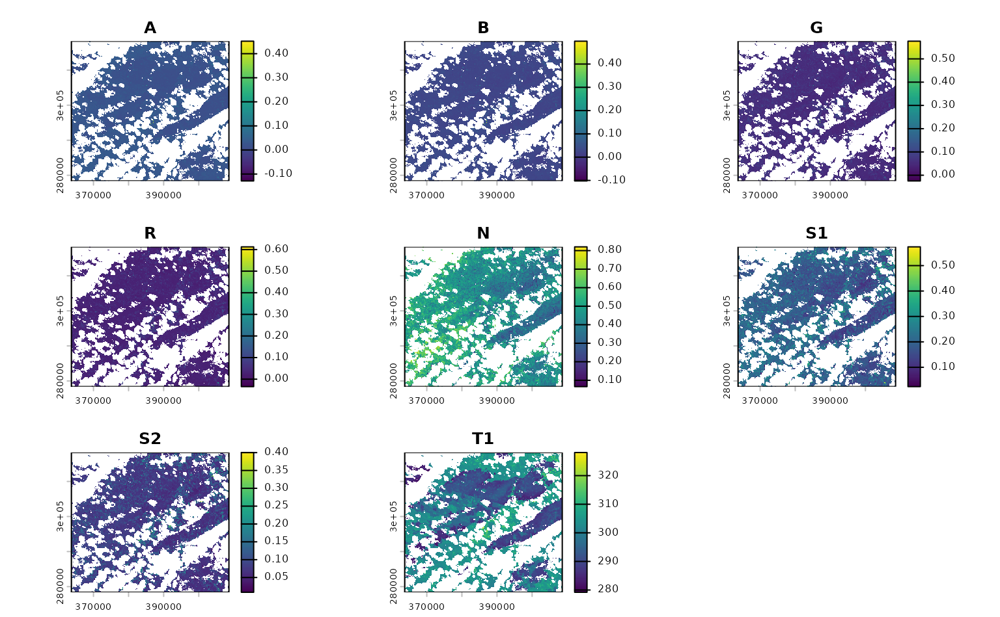

You can see transparent parts of each band where pixels in all images
from June were automatically masked out, due to their value in their
corresponding QA band. This behavior happens automatically, controlled
by the `mask_band` and `mask_function` attributes in our band mapping
object. The masking here is pretty basic; only pixels whose [QA band
indicates that they were “clear with lows
set”](https://d9-wret.s3.us-west-2.amazonaws.com/assets/palladium/production/s3fs-public/media/files/LSDS-1619_Landsat-8-9-C2-L2-ScienceProductGuide-v4.pdf)
are accepted, and all others are masked out:

``` r

attr(landsat_band_mapping$planetary_computer_v1, "mask_band")
#> [1] "qa_pixel"
attr(landsat_band_mapping$planetary_computer_v1, "mask_function")
#> function (raster, include = c("land", "water", "both"), ..., 
#>     masked_bits) 
#> {
#>     rlang::check_dots_empty()
#>     if (missing(masked_bits)) {
#>         if (missing(include)) 
#>             include <- include[[1]]
#>         include <- rlang::arg_match(include, multiple = TRUE)
#>         masked_bits <- list()
#>         if (any(c("land", "both") %in% include)) {
#>             masked_bits <- c(masked_bits, list(c(0:5, 7, 9, 11, 
#>                 13, 15)))
#>         }
#>         if (any(c("water", "both") %in% include)) {
#>             masked_bits <- c(masked_bits, list(c(0:5, 9, 11, 
#>                 13, 15)))
#>         }
#>     }
#>     else if (!missing(include)) {
#>         rlang::abort("Only one of `include` and `masked_bits` can be specified.", 
#>             class = "rsi_masked_bits_and_include")
#>     }
#>     classes <- vapply(masked_bits, bits_to_int, integer(1), USE.NAMES = FALSE)
#>     terra::`%in%`(raster, classes)
#> }
#> <bytecode: 0x55a33eb94e18>
#> <environment: namespace:rsi>
```

You can control this behavior by passing your own function to the
`mask_function` argument, or set this argument to `NULL` to skip masking
altogether.

If we just wanted a subset of bands in this image, we could subset the
object that’s passed to `asset_names`. For instance, to only download
the A band (what Planetary Computer calls `coastal`), we could subset
our object like this:

``` r

landsat_band_mapping$planetary_computer_v1["coastal"]
#> An rsi band mapping object with attributes:
#> mask_band mask_function stac_source collection_name query_function download_function sign_function class names
#> 
#> coastal 
#>     "A"
```

And last but not least, if we wanted to skip compositing altogether, we
could set the `composite_function` argument to `NULL` in order to
download each image in our spatiotemporal AOI separately:

``` r

ashe_no_composite <- get_landsat_imagery(
  aoi = projected_ashe,
  start_date = "2021-06-01",
  end_date = "2021-06-30",
  output_filename = tempfile(fileext = ".tif"),
  composite_function = NULL,
  mask_function = NULL # otherwise half of these images are blank
)
#> Warning: `mask_function` was NULL, but `mask_band` was not `NULL`.
#> ℹ `mask_band` will be ignored (not downloaded or used).
ashe_no_composite |>
  lapply(terra::rast) |>
  lapply(terra::plot) |>
  invisible()
```

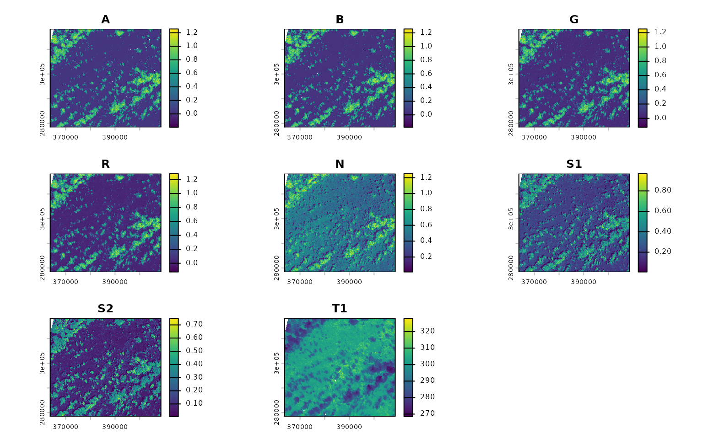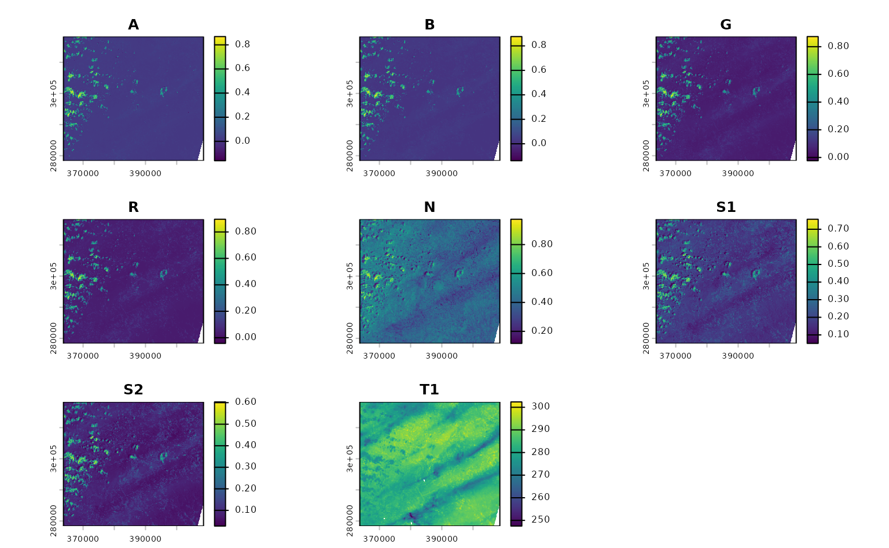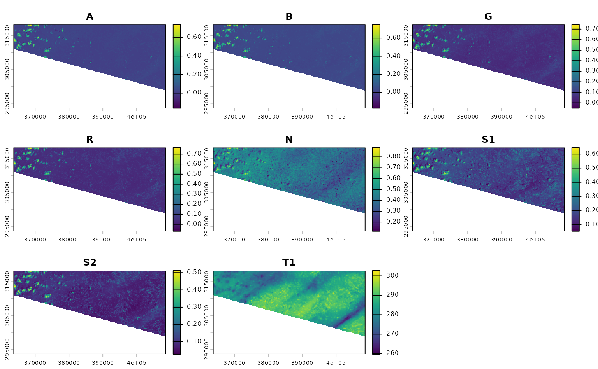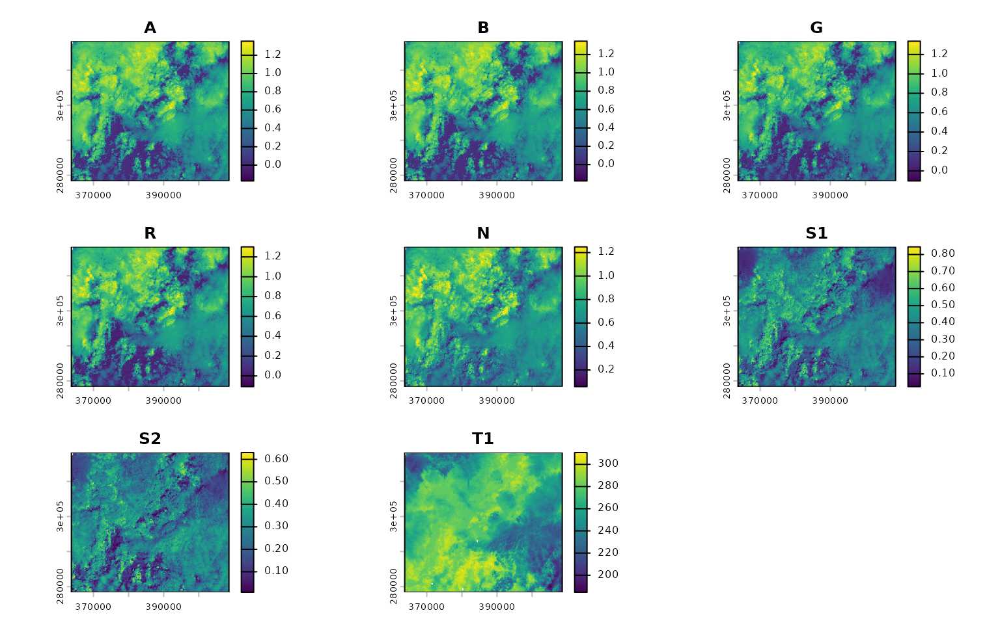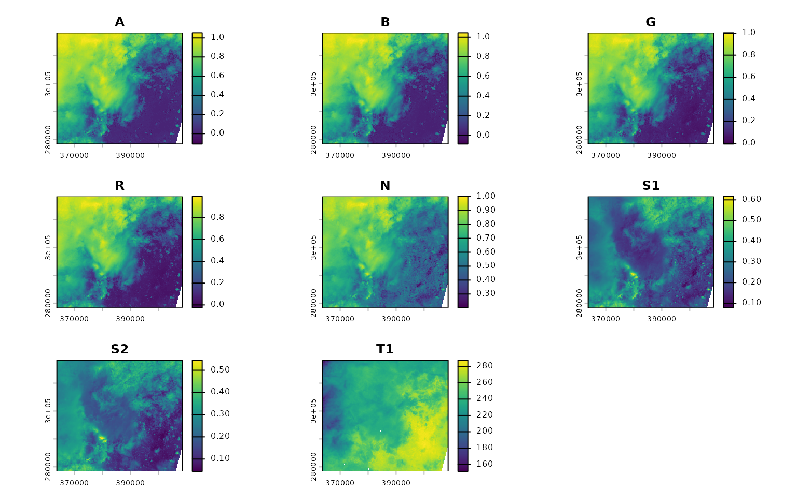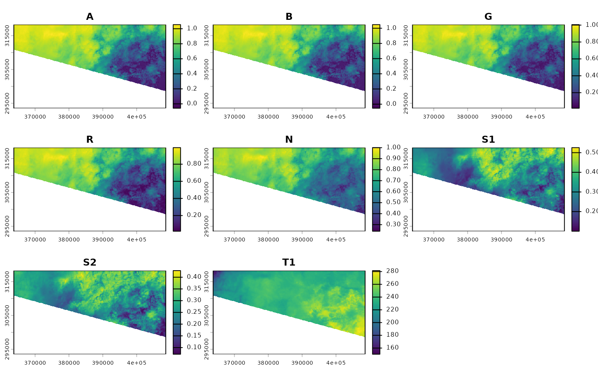

## Using CQL2 to refine queries to STAC APIs

This last section of the tutorial focuses on using CQL2 within rsi to
filter the items that will be downloaded. If you aren’t familiar with
using CQl2 in rstac, go read [the corresponding tutorial this is adapted
from
first](https://github.com/radiantearth/stac-site/blob/main/app/tutorials/r/2-using-rstac-and-cql2-to-query-stac-api/2-using-rstac-and-cql2-to-query-stac-api.en.md);
this tutorial assumes you understand
[`rstac::ext_filter()`](https://brazil-data-cube.github.io/rstac/reference/ext_filter.html)
already.

By the end of that tutorial, we had written relatively complex filters
using rstac and CQL2. For instance, if we wanted to find Landsat images:

- from June 2021,
- covering Ashe county,
- from Landsat-8,
- with less than 50% cloud cover,

We could write a filter that looks something like this:

``` r

geometry <- ashe |>
  sf::st_transform(4326) |>
  sf::st_bbox() |>
  rstac::cql2_bbox_as_geojson()
datetime <- rstac::cql2_interval("2021-06-01", "2021-06-30")

rstac::stac("https://planetarycomputer.microsoft.com/api/stac/v1") |>
  rstac::ext_filter(
    collection == "landsat-c2-l2" &&
      t_intersects(datetime, {{ datetime }}) &&
      s_intersects(geometry, {{ geometry }}) &&
      platform == "landsat-8" &&
      `eo:cloud_cover` < 50
  ) |>
  rstac::post_request()
#> ###Items
#> - features (1 item(s)):
#>   - LC08_L2SP_017035_20210628_02_T1
#> - assets: 
#> ang, atran, blue, cdist, coastal, drad, emis, emsd, green, lwir11, mtl.json, mtl.txt, mtl.xml, nir08, qa, qa_aerosol, qa_pixel, qa_radsat, red, rendered_preview, swir16, swir22, tilejson, trad, urad
#> - item's fields: 
#> assets, bbox, collection, geometry, id, links, properties, stac_extensions, stac_version, type
```

How the heck do we use that query inside
[`get_stac_data()`](https://docs.ropensci.org/rsi/reference/get_stac_data.md)
and friends?

Well, by default rsi uses a query function called
[`default_query_function()`](https://docs.ropensci.org/rsi/reference/deprecated.md).
This function is exported, which means you can see its source code by
calling the function without parentheses:

``` r

default_query_function
#> function (bbox, stac_source, collection, start_date, end_date, 
#>     limit, ...) 
#> {
#>     lifecycle::deprecate_warn("0.2.0", "default_query_function()", 
#>         "rsi_query_api()")
#>     rsi_query_api(bbox = bbox, stac_source = stac_source, collection = collection, 
#>         start_date = start_date, end_date = end_date, limit = limit, 
#>         ...)
#> }
#> <bytecode: 0x55a343fc6688>
#> <environment: namespace:rsi>
```

This is a relatively straightforward function – it composes a datetime
from the start date and end date, then uses rstac to get a list of all
the relevant items in its spatiotemporal bounding box (making sure to
use `items_fetch()` to retrieve all pages of results – told you it would
come up later!).

This works for most STAC APIs, but if we want to perform a more
complicated query we can provide our own custom query function in its
place. For instance, to perform the same CQL2 query as before, we can
effectively copy and paste our code from above into a new query function
and pass that to
[`get_landsat_imagery()`](https://docs.ropensci.org/rsi/reference/get_stac_data.md):

``` r

custom_query_function <- function(bbox,
                                  stac_source,
                                  collection,
                                  start_date,
                                  end_date,
                                  limit,
                                  ...) {
  # `bbox` is guaranteed to be in 4326 already
  geometry <- rstac::cql2_bbox_as_geojson(bbox)
  # `start_date` and `end_date` will be processed
  # and so hopefully will be in RFC-3339 formats
  datetime <- rstac::cql2_interval(start_date, end_date)

  request <- rstac::ext_filter(
    rstac::stac(stac_source),
    collection == {{ collection }} && # I could have left this hard-coded!
      t_intersects(datetime, {{ datetime }}) &&
      s_intersects(geometry, {{ geometry }}) &&
      platform == "landsat-8" &&
      `eo:cloud_cover` < 50
  )
  rstac::items_fetch(rstac::post_request(request))
}

ashe_cql <- get_landsat_imagery(
  aoi = projected_ashe,
  start_date = "2021-06-01",
  end_date = "2021-06-30",
  output_filename = tempfile(fileext = ".tif"),
  query_function = custom_query_function
)
ashe_cql |>
  terra::rast() |>
  terra::plot()
```

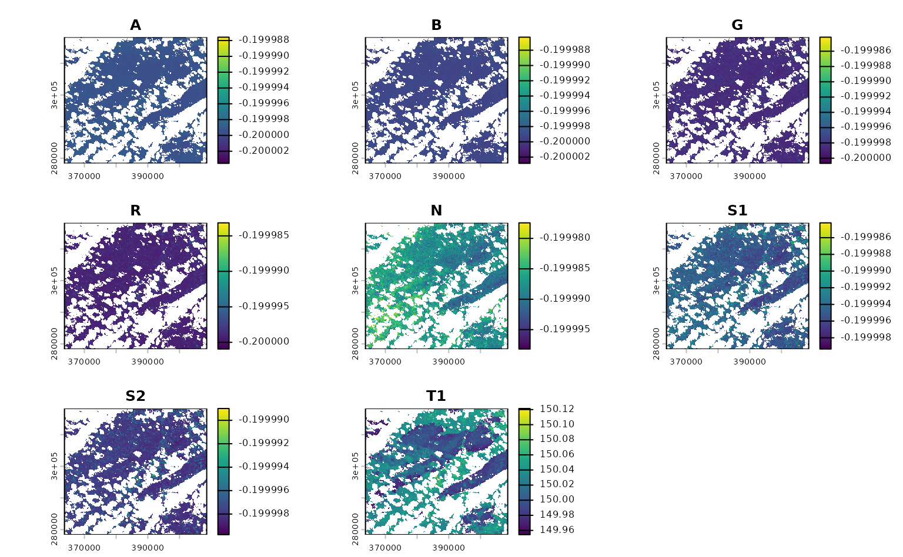

If we know how to express our desired query in CQL2, we can write
arbitrarily complex functions to make sure we’re only downloading the
precise data we’re interested in.

## A quick note on rsi and other packages for downloading STAC assets

rsi is not nearly the only package aiming to help R users take advantage
of STAC APIs and build cloud-native geospatial workflows. As shown
above, rsi is fundamentally built on top of the excellent rstac package,
which I think is a fantastic tool for interactively exploring STAC APIs
as well as building and executing queries. My hope is that rsi can
provide a useful layer of abstraction over rstac for efficiently
downloading assets and performing some of the most common rescaling,
masking, and compositing tasks involved in standard data processing
workflows.

There are also several other packages which also implement workflows for
efficiently accessing and processing data from STAC endpoints, among
them the [gdalcubes](https://gdalcubes.github.io/) and
[sits](https://e-sensing.github.io/sitsbook/) packages. A core
difference between rsi and these packages is that rsi does not have a
data model: rsi is focused entirely on finding the bits of data you want
from remote endpoints, and getting those bits on your local machine for
you to process with your normal spatial data tooling. There are no new
classes in rsi (other than the band mapping objects), and the outputs of
functions are local rasters. This is an approach that fits better in my
head than the more abstract delayed computations in some other packages;
at the same time, it’s possible that this approach can be less
efficient, downloading more data at finer resolutions than is actually
needed for a given task.

To make data-downloading functions run faster, make sure you’re only
requesting the data you actually need – often restricting the number of
assets to be downloaded from each item, specifying a more precise
bounding box, or using a narrower date range can cut the amount of data
to be downloaded significantly. If there’s no way around downloading a
large amount of data, consider if running your code on a virtual (cloud)
server that’s physically closer to your data makes sense for your use
case. Many data providers publish information on where their collections
are hosted (with cloud providers like Microsoft naming the specific
region it’s in), and using servers that are closer to the data can
result in notably faster download speeds.
